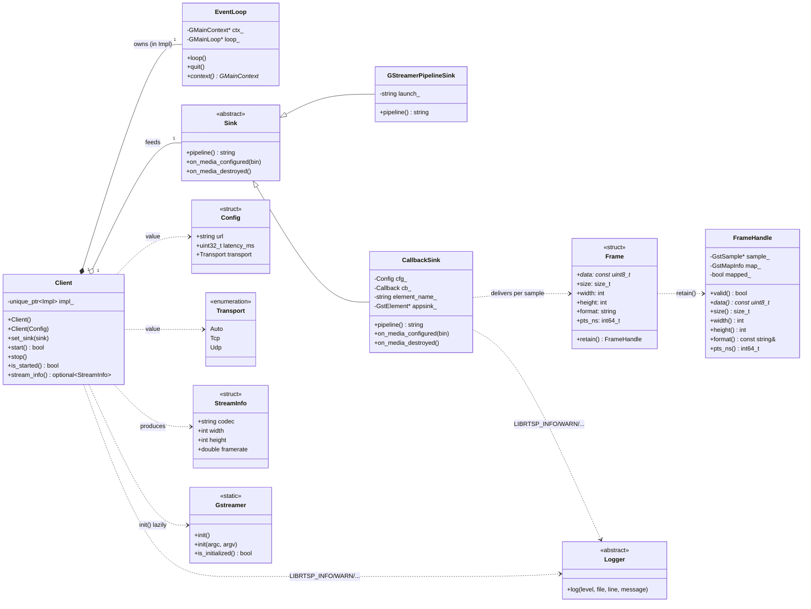

# Client UML

Class diagram of the RTSP `Client` and its collaborators inside the
`librtsp` namespace. Only the public surface and the major private members
are shown; minor helpers and accessors are omitted for readability.



## Relationships at a glance

- **Client owns an EventLoop** (inside its `Impl`): each Client has its own
  private `GMainContext` so several clients can coexist without contending
  for the global-default context. A dedicated worker thread iterates that
  loop while the client is started.
- **Client holds a Sink** by `shared_ptr`: the user constructs the Sink,
  hands it to `Client::set_sink`, and may retain a reference (typical for
  `CallbackSink`, where the lambda captures state the user wants to keep
  around).
- **Sink is abstract**: `GStreamerPipelineSink` (raw launch passthrough)
  and `CallbackSink` (decoded frames to a user lambda) are the concrete
  subclasses shipped today.
- **CallbackSink delivers Frames** per appsink sample. A `Frame` is a
  short-lived view valid only during the user callback.
- **`Frame::retain()` upgrades to `FrameHandle`** — the FrameHandle owns a
  ref on the underlying `GstSample` and keeps its own buffer mapping, so
  the bytes stay valid until the handle is destroyed.
- **Gstreamer is a static-only singleton** initialized lazily by Client or
  explicitly from `main()`.
- **Logger is an abstract sink** registered once via `set_logger(...)`. The
  library reaches it through the `LIBRTSP_*` macros; nothing in the diagram
  *holds* a Logger pointer — they all look it up dynamically.

## Frame lifecycle

```
appsink "new-sample" signal
    │
    └─> on_new_sample_cb pulls GstSample
            │
            └─> CallbackSink::dispatch(sample)
                    │
                    ├─> map buffer, build Frame view
                    ├─> cb_(frame)                      <= user callback runs here
                    │       │
                    │       └─ optional: frame.retain() => FrameHandle
                    └─> unmap buffer, sample unrefd (unless retained)
```

## Notation

| Arrow | Meaning |
|---|---|
| `A *-- B` | A owns B by composition (B destroyed with A) |
| `A o-- B` | A aggregates B (shared, B may outlive A) |
| `A <\|-- B` | B inherits from A |
| `A ..> B` | A depends on B (uses, doesn't own) |
