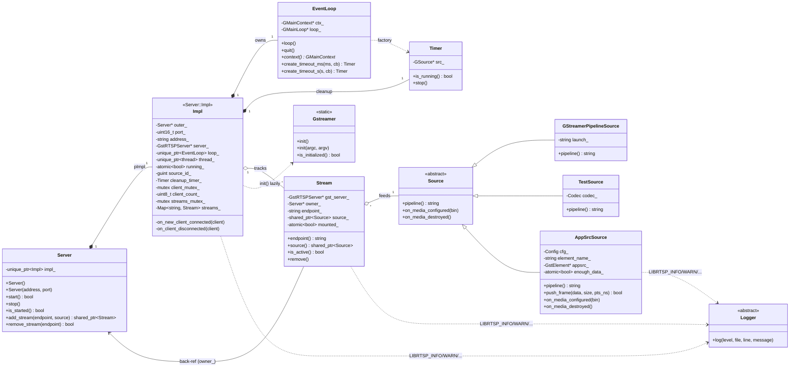

# Server UML

Class diagram of the RTSP `Server` and its collaborators inside the
`librtsp` namespace. `Server` uses the PIMPL pattern, its public header
exposes only the API and a `unique_ptr<Impl>`; all runtime state lives in
the nested `Server::Impl` defined in the .cpp file. Both classes are
shown so the ownership graph is readable.

## Relationships at a glance

- **Server holds a unique_ptr to its Impl**: the public header drops all
  GStreamer / threading / EventLoop / Timer includes. Public methods are
  one-line forwarders to `impl_->…`.
- **Impl owns an EventLoop**: each Server has its own `GMainContext` so
  several servers can coexist without contending for the global-default
  context.
- **Impl owns a cleanup Timer**: periodic `gst_rtsp_session_pool_cleanup`,
  scheduled on the server's own EventLoop context.
- **Impl tracks Streams**: `streams_` keeps a shared_ptr per mounted
  endpoint. The user also gets a shared_ptr from `Server::add_stream`.
- **Stream points back at Server** via `owner_` (the *outer* class, not
  Impl), so `Stream::remove()` calls `Server::detach_stream`, which simply
  forwards to `impl_->detach_stream`.
- **Stream owns a Source** via shared_ptr; the user typically also keeps a
  shared_ptr to the Source to push frames into it (AppSrcSource case).
- **Source is abstract**: `GStreamerPipelineSource`, `TestSource`, and
  `AppSrcSource` are the concrete subclasses shipped today.
- **Gstreamer is a static-only singleton** initialized lazily by Impl or
  explicitly from `main()`.
- **Logger is an abstract sink** registered once via `set_logger(...)`. The
  library reaches it through the `LIBRTSP_*` macros; nothing in the diagram
  *holds* a Logger pointer, they all look it up dynamically.

## Notation

| Arrow | Meaning |
|---|---|
| `A *-- B` | A owns B by composition (B destroyed with A) |
| `A o-- B` | A aggregates B (shared, B may outlive A) |
| `A <\|-- B` | B inherits from A |
| `A ..> B` | A depends on B (uses, doesn't own) |
| `A --> B` | A holds a reference to B |
